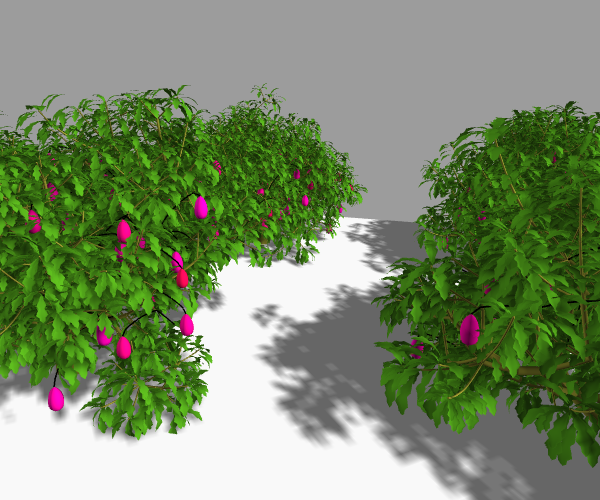
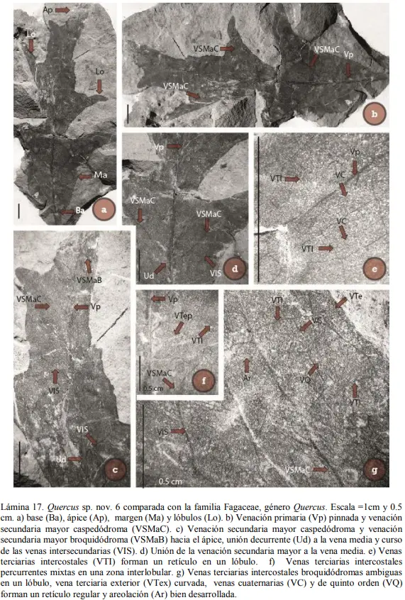
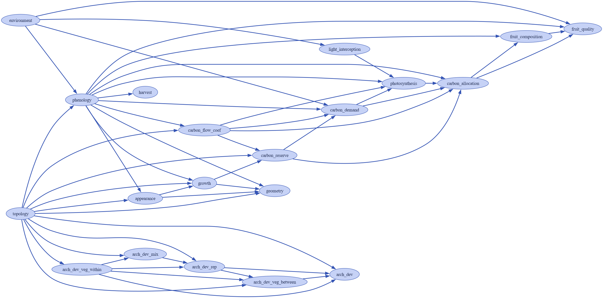

# vmango-lab-paleotest

- click to play!

    - [](https://mybinder.org/v2/gh/jcvl-udg/vmangolab-paleotest/main?urlpath=lab/tree/notebooks/vmango.ipynb)
---

La extension **PaleoTest** , esta pensada para realizar modelos paleobotanicos mediante la simulacion de agentes/plantas a traves de aproximaciones a las tecnicas:
- Pariente Vivo más Cercano (PVC)
- Aproximación Morfológico Estructural (AME)

vamango-lab<sup>[1](#Vaillant_2022)</sup>es un entorno para simulacion y analisis de crecimiento, desarrollo, produccion frutal y arquitectura de arboles de mango siendo una extension del modelo V-Mango<sup>[2](#Boudon_2020)</sup> desarrollado en Python mediante xarray-simlab<sup>[3](#xarray-simlab_2019)</sup>, la arquitectura del modelo construye y reimplementa funciones de alto-nivel buscando que el usuario use el modelo
desde la interfaz de `vmlab` (e.g. `vmlab.create_setup` & `vmlab.run`) , tambien cuenta con un modulo de paralelizacion configurado.



(en la imagen se aprecia la geometria de la hoja, despues de modificarse "lobular" para imitar al Quercus).

[El README original](https://github.com/jvail/vmango-lab) contiene algunos ejemplos de otras "Funciones de alto nivel"
y de configuraciones para el modelo se encuentra en el repositorio forkeado.

---
En este caso especifico se busca modelar la especie **Fagaceae (Quercus)** de la que se tiene registro en multiples investigaciones.




Ademas se construye este primer acercamiento pensando en la menor cantidad de modificaciones al modelo base(Mango), 
la simulacion de este arbol de bellotas (Quercus: encinas, robles, quejigos y alcornoques) busca un acercamiento
cientificamente informado para la generacion del modelo.


### Formacion Paleobotánica Olmos (Coahuila,México)

[Formación Olmos - COAH](https://paleobiologia.wixsite.com/evolucionplantae/formacion-olmos)

[Inferencia del clima y elevación de la formación Olmos, Coahuila,México, del Cretácico tardío (Maestrichtiano) mediante lafisonomía de hojas fósiles y determinación de nuevo material](https://ru.dgb.unam.mx/server/api/core/bitstreams/b2b42bce-4593-4417-a6f2-dd6d3c89fff2/content)

[Síntesis de los trabajos paleobotánicos del Cretácico en México](https://www.scielo.org.mx/scielo.php?script=sci_arttext&pid=S1405-33222014000100009)

[Flora and climate of the Olmos Formation (upper Campanian–lower Maastrichtian), Coahuila, Mexico: a preliminary report](https://www.academia.edu/2103322/Flora_and_climate_of_the_Olmos_Formation_upper_Campanian_lower_Maastrichtian_Coahuila_Mexico_a_preliminary_report)

[Paleobotánica Para entender la evolución y la biodiversidad en México](https://www.botanicalsciences.com.mx/index.php/botanicalSciences/article/view/3122/4778)

## Installation

### Para usuarion con Conda instalado

Recomiendo el uso de Anaconda Navigator, esto facilita es uso de entornos aislados:

```bash
git clone https://github.com/fredboudon/vmango-lab.git
cd vmango-lab
conda env create -f binder/environment.yml
conda activate vmango-lab
```

## Useful resources for important dependencies of vmlab
- [xsimlab (v0.5.0):](https://xarray-simlab.readthedocs.io/en/latest/)https://xarray-simlab.readthedocs.io/en/latest/
- [xarray:](http://xarray.pydata.org/en/stable/index.html)http://xarray.pydata.org/en/stable/index.html
- [igraph:](https://igraph.org/python/)https://igraph.org/python/
- [scipy.sparse.csgraph:](https://docs.scipy.org/doc/scipy/reference/sparse.csgraph.html#module-scipy.sparse.csgraph)https://docs.scipy.org/doc/scipy/reference/sparse.csgraph.html#module-scipy.sparse.csgraph

---
<a name="Vaillant_2022">1</a>Jan Vaillant, Isabelle Grechi, Frédéric Normand, Frédéric Boudon, Towards virtual modelling environments for functional–structural plant models based on Jupyter notebooks: application to the modelling of mango tree growth and development, in silico Plants, Volume 4, Issue 1, 2022, diab040, https://doi.org/10.1093/insilicoplants/diab040

<a name="Boudon_2020">2</a> Frédéric Boudon et al. V-Mango: a functional–structural model of mango tree growth, development and fruit production, Annals of Botany, Volume 126, Issue 4, 14 September 2020, Pages 745–763

<a name="xarray-simlab_2019">3</a> Kaandorp, V.P., Doornenbal, P.J., Kooi, H., Peter Broers, H., de Louw, P.G.B., 2019. Temperature buffering by groundwater in ecologically valuable lowland streams under current and future climate conditions. Journal of Hydrology X 3, 100031. https://doi.org/10.1016/j.hydroa.2019.100031


## Referencias
[Relevance of the Coal Mining Deposits and the Olmos Formation in NE Mexico to Geoheritage: Scientific, Geological and Educational Attributes that Highlight its Conservation](https://link.springer.com/article/10.1007/s12371-025-01071-y)


```
[1] Plantas fósiles e inferencia paleoclimática: aproximaciones metodológicas 
y algunos ejemplos para México

Hugo I. Martínez-Cabrera 
José L. Ramírez-Garduño2
Emilio Estrada-Ruiz

Boletín de la Sociedad Geológica Mexicana
Volumen 66, núm. 1, 2014, p. 41-52
```


```
[2] Modelling the Plants and Ecosystem of the Rhynie Chert (2015)
Mark Kolesza
UNIVERSITY OF CALGARY
```

```
[3] The Algorithmic Beauty of Plants
- Przemyslaw Prusinkiewicz
- Aristid Lindenmayer

With:
James S. Hanan
F. David Fracchia
Deborah Fowler
Martin J. M. de Boer
Lynn Mercer
```

```
[4] Visual models of plant development (1996)
Przemyslaw Prusinkiewicz, Mark Hammel, Jim Hananz, and Radomir Mech
Department of Computer Science University of Calgary
Calgary, Alberta, Canada
zCSIRO - Cooperative Research Centre for Tropical Pest Management
Springer-Verlag 1996
```

```
Using L−Systems for Modeling the Architecture and Physiology of Growing Trees: 
The L−PEACH Model Mitch Allen (2004)

Przemyslaw Prusinkiewicz
Theodore DeJong

Department of Pomology, University of California, Davis
Department of Computer Science, University of Calgary
```

```
V-Mango: a functional–structural model of mango tree growth, development and fruit production 
Annals of Botany, Volume 126, Issue 4, 14 September 2020, Pages 745–763, https://doi.org/10.1093/aob/mcaa089
```


[Revista UNAM CIENCIAS 129-130, JULIO-DICIEMBRE 2018](https://www.revistacienciasunam.com/pt/208-revistas/revista-ciencias-129-130/2154-el-futuro-de-los-bosques-de-encinos-en-m%C3%A9xico-frente-al-cambio-global.html)

"Gran parte de la responsabilidad recae sobre los científicos, quienes debiéramos generar conocimientos relevantes sobre la ecología de éste y otros grupos de organismos para transmitirlos por los canales pertinentes al resto de la sociedad. De otra manera, los tomadores de decisiones no podrán diseñar políticas públicas efectivas en materia de conservación ambiental".


[Fossil Plants as Tests of Climate (Albert Charles Seward) - Sedgwick Essay Prize for the Year 1892](https://github.com/manjunath5496/Paleobotany-Books/blob/master/pale(3).pdf)


---sin acceso(?)
Paratropical rainforest from the Olmos Formation (upper Campanian), Coahuila, Mexico
Author links open overlay panel
https://www.sciencedirect.com/science/article/abs/pii/S0195667123003415


### Guias Paleobotany

- [Extinct_plants](https://github.com/PaleoNate/extinct_plants)

This is a place for the paleobotany and paleo-art communities to find references to papers with illustrations of extinct plants.

- [Paleobotanical-3D-reconstruction-guides Public](https://github.com/robertlmenning/Paleobotanical-3D-reconstruction-guides)

Paleobotany focused guides for segmenting, editing, and animating 3D reconstructions of plant fossils

- [Paleobotany-Books](https://github.com/manjunath5496/Paleobotany-Books)

"Now, evolution is the substance of fossils hoped for, the evidence of links not seen." ― Duane T. Gish

- [Paleobotany_research](https://github.com/BenjaminVanOttenberg/paleobotany_research)

### PaleoBioDB
[ThePaleobiology Database](https://paleobiodb.org/#/)
[Family Nelumbonaceae Richard 1827 (lotus)](https://paleobiodb.org/classic/basicTaxonInfo?taxon_no=txn:55399)


[SYNTHESYS+](https://www.synthesys.info/)

